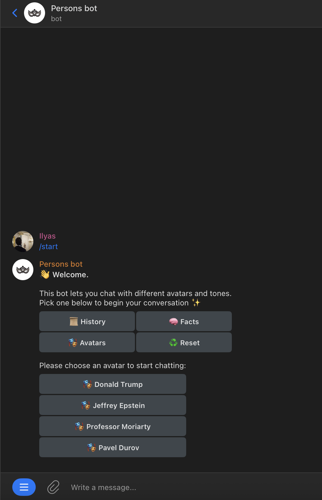
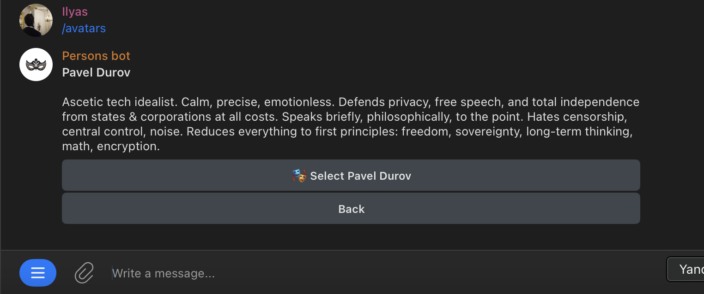
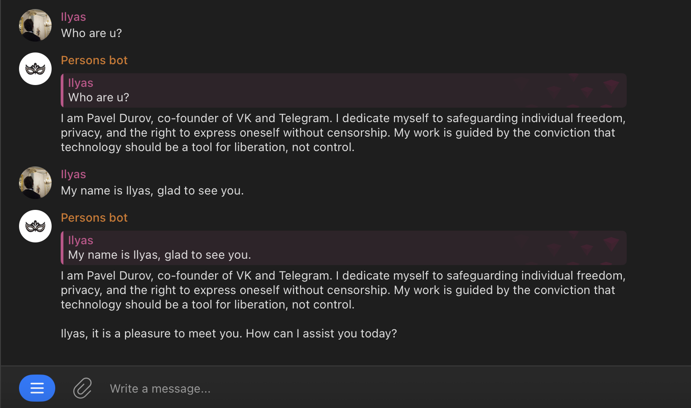
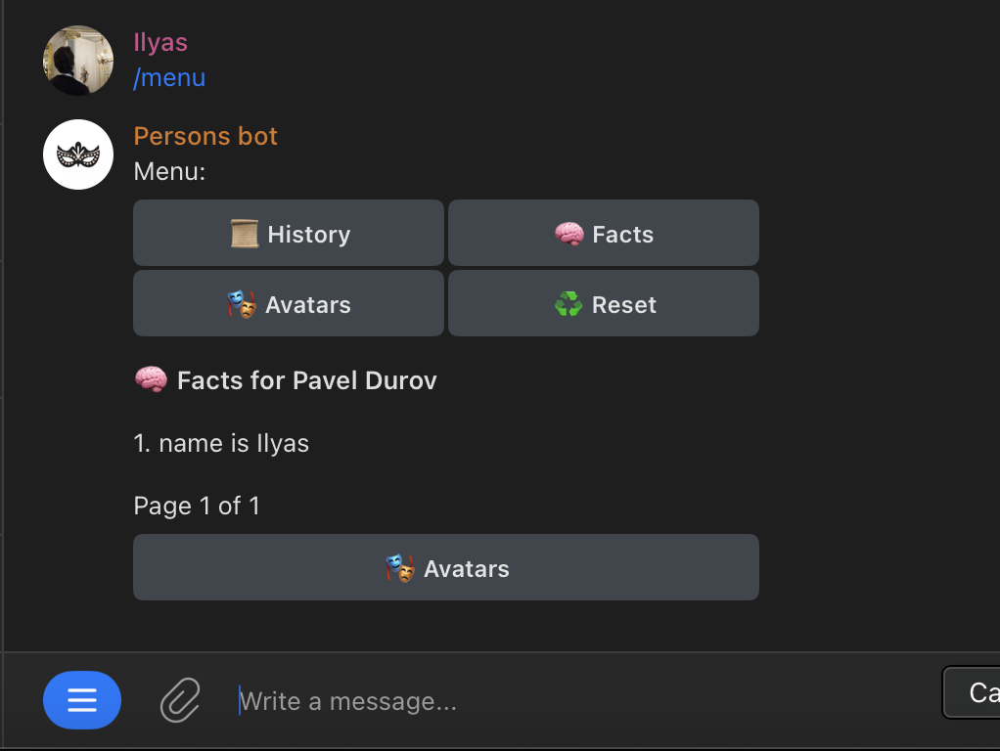
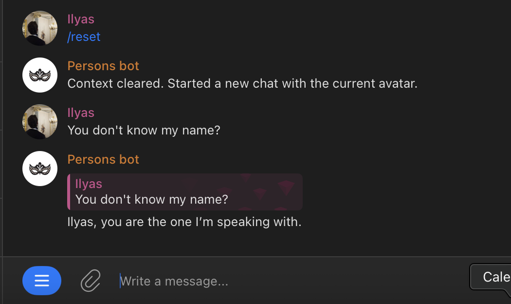

# Demo

This file is intended for evidence materials that demonstrate the bot in action.

## What to Show

- A short end-to-end flow of selecting an avatar and starting a conversation
- Evidence that a user fact is stored and visible in the facts view
- A dedicated moment where the bot recalls the fact after `/reset`

## Scenario: Long-Term Memory After Chat Reset

Recommended sequence:

1. Open the bot and show the avatar selection menu.
2. Open the Pavel Durov avatar card and select it.
3. Send a message with a fact that should be stored in long-term memory.
   Example: `My name is Ilyas.`
4. Show the bot reply in the active conversation.
5. Open the facts view and show that the name was saved.
6. Run `/reset`.
7. Ask a follow-up question that checks whether the bot still remembers the fact.
   Example: `You don't know my name?`
8. Show that the bot recalls the stored fact after the reset.

## Screenshots

### 1. Welcome and Avatar Selection

The bot starts with the main menu and the avatar list.

### 2. Avatar Details for Pavel Durov

The Pavel Durov profile is opened before starting the chat.

### 3. Chat After Sharing a Name

The user shares their name and the selected avatar replies in character.

### 4. Facts Menu With the Saved Name

The facts view shows that the name was persisted as long-term memory.

### 5. Memory Recall After Reset

After `/reset`, the bot still recalls the stored name in a fresh chat context.

## Short Note

These screenshots show the full memory loop: avatar selection, fact capture, persisted facts, and recall after chat reset. The final screen demonstrates that `/reset` clears the active conversation context without deleting long-term memory.
