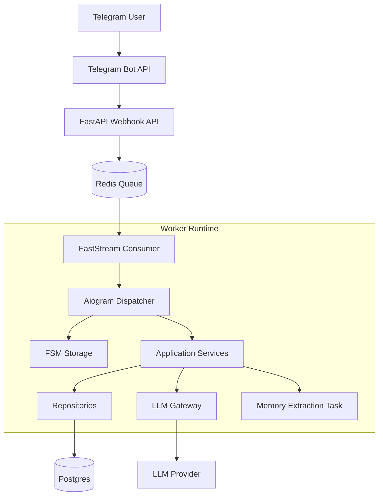

# Persona chatbot

# Executive summary

**One-liner:**

Telegram bot with selectable AI avatars, short-term chat memory, long-term fact memory, and streamed replies.

The implementation keeps the domain model minimal, while using a queue-backed worker runtime to keep webhook ingestion fast and isolate background memory extraction.

**Core user value:**

The user gets a more personalized and coherent conversation experience: the bot responds in the chosen avatar’s style, remembers recent dialogue context, and can recall important facts from older conversations.

**Primary constraints:**

- This is a fast-delivery MVP for a test task, so the architecture must stay minimal and implementation-focused.
- The bot must use Aiogram 3.x and FSM for dialogue state handling.
- The system must implement two memory layers: recent dialogue history and persistent fact memory.
- LLM responses should be streamed to improve UX.
- The system must tolerate LLM/API failures and return a clear fallback message to the user.
- Configuration must come from environment variables, and the solution must be easy to run locally.

# Requirements

### Functional

- The bot must start with `/start`, greet the user, and show an inline keyboard with predefined avatar choices.
- Each avatar must have a name and a system prompt that defines its behavior and speaking style.
- The selected avatar must be persisted for the current user and used to create or activate the current chat session.
- The bot must maintain an active chat for the current user-avatar session.
- The bot must support a chat flow where user messages are sent to an LLM together with the avatar prompt and conversation context.
- The bot must maintain short-term memory as recent messages of the active chat session.
- The bot must maintain long-term memory by extracting durable facts from the dialogue and storing them per user and per avatar.
- The bot must inject stored long-term facts into future LLM requests so the avatar can recall them later.
- The bot must stream LLM responses back to Telegram by editing an existing bot message or sending partial updates.
- The bot must support `/history` and return the latest messages from the active chat.
- The bot must support `/facts` and let the user browse stored long-term facts by avatar.
- The bot should support `/reset` by closing the current chat and creating a new empty chat while preserving long-term facts.
- The bot should support `/avatars` by returning the user to avatar selection and starting a new chat after selection.
- The bot must use FSM to manage at least two states: avatar selection and active chat.
- The bot must store data in a relational database with at least `users`, `avatars`, `chats`, `messages`, and `memory_facts` entities.
- The bot must handle LLM/API failures gracefully and return a clear user-facing fallback response.

### Non-functional

- **Latency:** For normal non-streaming operations such as avatar selection, history, facts, and reset, target p95 under 500 ms excluding Telegram delivery delays. For chat responses, time-to-first-token should be as low as practical; for MVP, the key requirement is visible incremental streaming rather than strict full-response latency.
- **Availability:** No formal production SLO is required for the test MVP. The system should remain functionally stable during normal local/demo usage and fail gracefully on upstream LLM errors.
- **Scalability:** The MVP only needs to support single-instance operation and a small number of concurrent users during demonstration. Horizontal scaling is explicitly out of scope at this stage.
- **Cost sensitivity:** Yes. The design should minimize infrastructure and LLM cost, avoid unnecessary background components, and remain runnable on a local machine or a small dev environment.
- **Security/compliance:** API keys must be loaded from environment variables. User-related facts must be stored only to the degree required for the memory feature. No advanced compliance scope is assumed for MVP.
- **Observability:** At minimum, the service should provide structured logs for incoming updates, LLM calls, fact extraction, database failures, and user-visible errors.

## Scope

### MVP Scope

**Features**

- User starts the bot with `/start` and selects one of the predefined avatars.
- The bot stores the selected avatar for the current user.
- The bot creates and maintains an active chat for the current user-avatar session.
- Each user message is appended to the active chat and sent to the LLM together with the avatar prompt, recent chat history, and stored long-term facts.
- The bot stores recent dialogue turns inside the active chat and uses them as short-term memory.
- The bot extracts durable facts from the dialogue and stores them as long-term memory for the current user and avatar.
- The bot streams assistant responses back to Telegram.
- The bot supports `/menu` for quick access to common actions.
- The bot supports `/history` for recent messages of the active chat.
- The bot supports `/facts` for browsing stored long-term facts by avatar.
- The bot supports `/reset` by rotating the active chat while preserving long-term facts.
- The bot supports `/avatars` by returning the user to avatar selection.
- The bot handles LLM and transport errors gracefully.

**Architecture principles**

- Feature scope remains MVP-sized, but runtime execution is split into API ingress and worker processing.
- API ingress stays thin and only accepts Telegram webhook traffic and enqueues updates.
- Worker runtime owns aiogram dispatching, FSM transitions, business orchestration, and LLM interaction.
- Relational database is the durable source of truth for users, chats, messages, avatars, and long-term facts.
- Redis is used as an operational dependency for queueing, FSM storage, and same-user chat locking.
- Long-term fact extraction is asynchronous and runs outside the user-facing reply path.
- Prefer thin transport layers, service-level orchestration, and repository-based persistence boundaries.

**Explicit non-goals (MVP)**

- Multi-node deployment.
- Horizontal scaling.
- Multi-channel support beyond Telegram.
- Semantic search over memory.
- Embedding-based retrieval.
- Admin panel or operator dashboard.
- Background job orchestration.
- Advanced moderation pipeline.
- Fine-grained analytics.
- Production-grade HA setup.

---

# High-level architecture

### Mental model

The system keeps the domain model minimal, but uses a queue-backed runtime to decouple Telegram webhook ingestion from bot execution and background memory extraction.

The real runtime consists of two execution surfaces:

- **API ingress:** accepts Telegram webhook traffic and publishes raw updates to Redis
- **Worker runtime:** consumes queued updates, runs aiogram handlers, executes services, streams LLM replies, and processes background memory extraction

**Planes**

- **Ingress layer:** FastAPI webhook endpoint that validates and enqueues Telegram updates.
- **Bot execution layer:** FastStream worker + aiogram dispatcher + middlewares + handlers.
- **Application layer:** services that orchestrate avatar selection, active chat lifecycle, message persistence, prompt composition, and command handling.
- **Infrastructure layer:** PostgreSQL repositories, Redis broker/storage/locks, and LLM provider integration.

**Key rule**

- Telegram webhook ingress must stay thin.
- Business logic, chat orchestration, and LLM work execute in the worker.
- The LLM is stateless and never acts as a source of truth.
- Long-term memory extraction is decoupled from the user-visible reply path.

### Interaction summary

- **Telegram webhook:** Telegram sends updates to FastAPI ingress.
- **Internal queue:** The API publishes raw updates to Redis queue `telegram.updates`.
- **Worker execution:** Worker consumes updates and feeds them into aiogram dispatcher.
- **LLM over HTTPS:** Worker calls the LLM provider for streamed reply generation and structured fact extraction.
- **Database access:** Worker reads and writes users, avatars, chats, messages, and memory facts in PostgreSQL.
- **Background memory extraction:** After a completed assistant turn, worker publishes a snapshot task to `memory.extract_facts`.

## Source of Truth (SoT)

| **Concern** | **SoT** | **Owner** |
| --- | --- | --- |
| Telegram user mapping | `users` table | Worker / Backend |
| Active chat pointer | `users.active_chat_id` | Worker / Backend |
| Avatar definitions | `avatars` table | Backend |
| Chat sessions | `chats` table | Backend |
| Short-term dialogue history | `messages` table scoped by `chat_id` | Backend |
| Long-term memory facts | `memory_facts` table scoped by `user_id` and `avatar_id` | Backend |
| FSM runtime state | Redis-backed aiogram FSM storage | Worker runtime |
| Queued Telegram updates | Redis queue `telegram.updates` | API + Worker |
| Queued memory extraction tasks | Redis queue `memory.extract_facts` | Worker |
| Generated request context | Ephemeral in worker memory | Worker |
| Assistant text generation | LLM response stream | LLM provider |

## Diagrams

### MVP

---

# Runtime flows

### Avatar selection and chat activation

### **Flow: Avatar selection and chat activation (MVP)**

**Goal**

Move the user from `/start` into an active chat session with a selected avatar.

**Actors**

- Telegram user
- Telegram Bot API
- FastAPI ingress
- Redis queue
- Worker runtime
- Relational database

**State model**

- **FSM states**:
    - `choosing_avatar`
    - `chatting`
- **Postgres tables**:
    - `users`
    - `avatars`
    - `chats`

**Endpoints / handlers**

- `/start`
- `callback_query:select_avatar`

**Flow steps (MVP)**

1. User sends `/start` in Telegram.
2. Telegram delivers the update to the webhook API.
3. API enqueues the raw update into Redis.
4. Worker consumes the update and feeds it into aiogram.
5. Handler creates or loads the user record.
6. Handler loads predefined avatars.
7. Bot sends greeting and inline keyboard with avatar choices.
8. FSM state is set to `choosing_avatar`.
9. User clicks an avatar button to open its preview.
10. Callback update goes through the same API -> queue -> worker path.
11. Worker validates `avatar_id` and shows avatar info with explicit select/back actions.
12. User confirms avatar selection.
13. Worker creates a new chat for `(user_id, avatar_id)`.
14. Worker updates `users.current_avatar_id` and `users.active_chat_id`.
15. FSM state switches to `chatting`.
16. Bot sends confirmation message and invites the user to start chatting.

**Invariants**

- At most one active chat is linked from `users.active_chat_id`.
- Avatar selection must reference an existing avatar.
- User cannot enter chat mode without an active chat.

### Main chat turn with short-term and long-term memory

### **Flow: Main chat turn with short-term and long-term memory (MVP)**

**Goal**

Generate a streamed avatar-style reply using the current user message, recent messages from the active chat, and stored long-term facts.

**Actors**

- Telegram user
- Telegram Bot API
- FastAPI ingress
- Redis queue
- Worker runtime
- Relational database
- LLM provider

**State model**

- **FSM states**:
    - `chatting`
- **Postgres tables**:
    - `users`
    - `avatars`
    - `chats`
    - `messages`
    - `memory_facts`

**Endpoints / handlers**

- `message handler in chatting state`

**Data used in this flow**

- **User state**
    - active chat id
    - Telegram user identity
- **Short-term memory**
    - recent messages from the active chat
- **Long-term memory**
    - durable facts stored for the current user and avatar
- **Current input**
    - the new user message being processed now

**Context composition rule**

The worker composes LLM context from three different sources:

1. avatar behavior
2. long-term memory
3. recent active-chat history

These sources are passed differently:

- **Avatar behavior** is passed as `system` instruction.
- **Long-term facts** are passed as a separate compact memory block.
- **Recent chat history** is passed as structured chat messages with roles, not as a pasted transcript blob.

**Short-term memory rule**

- Recent history is loaded from `messages` by `chat_id`.
- Only the most recent bounded window is included.
- Messages are ordered chronologically before request assembly.

**Long-term memory rule**

- Long-term facts are scoped by `(user_id, avatar_id)`.
- Facts survive chat reset.
- Only a bounded subset is injected into the LLM request.

**Flow steps (MVP)**

1. User sends a text message in Telegram.
2. Telegram sends the update to the webhook API.
3. API publishes the raw update to Redis queue `telegram.updates`.
4. Worker consumes the update and feeds it into aiogram.
5. Same-user chat lock prevents overlapping chat processing for the same Telegram user.
6. Handler delegates orchestration to chat service.
7. Chat service loads the current user and active chat.
8. Chat service loads the avatar of the active chat and its system prompt.
9. Chat service loads recent message history from the active chat.
10. Chat service loads stored long-term facts for `(user_id, avatar_id)`.
11. Chat service persists the incoming user message.
12. Chat service assembles the LLM request from avatar instruction, long-term facts, recent chat history, and the current user message.
13. Chat service requests streamed generation from the LLM provider.
14. Bot sends placeholder or draft output to Telegram.
15. Worker streams chunks back to Telegram by editing draft messages.
16. After generation completes, chat service persists the final assistant message.
17. Chat service publishes a background memory extraction task containing the exact completed turn snapshot.
18. Flow completes and the user remains in `chatting` state.

**Invariants**

- Chat flow is allowed only when the user has an active chat.
- Every persisted assistant reply must correspond to a persisted user message in the same chat.
- Short-term memory must contain only messages from the active chat.
- Long-term facts must be scoped by both `user_id` and `avatar_id`.
- Recent history must be passed as structured messages, not as a pasted transcript blob.
- Long-term memory must be injected separately from chat history.
- The LLM is not a source of truth; only database state is durable.
- Memory extraction must not block the main reply path.

**Failure handling**

- If no active chat exists, backend returns the user to avatar selection flow.
- If user-message persistence fails before the LLM call, generation does not start.
- If the LLM call fails before streaming starts, backend sends a fallback user-facing message.
- If streaming fails mid-response, partial output may still be preserved, but the worker must not crash.
- If assistant-message persistence fails after generation, the failure is logged and surfaced as a generic error if needed.
- If memory extraction task publish fails, main chat reply remains successful.

### Long-term fact extraction

### **Flow: Long-term fact extraction, deduplication, and persistence (MVP)**

**Goal**

Extract durable user-related facts from a completed chat turn, deduplicate them deterministically, and persist them for reuse in future chats with the same avatar.

**Actors**

- Worker runtime
- Redis queue
- Relational database
- LLM provider

**State model**

- **Postgres tables**:
    - `chats`
    - `memory_facts`

**Extraction trigger**

Fact extraction runs asynchronously after a completed assistant turn.

The chat service publishes a task that contains an exact turn snapshot:

- `chat_id`
- `user_message_id`
- `assistant_message_id`
- `user_message_text`
- `assistant_message_text`

The memory worker consumes this snapshot directly instead of re-reading the “latest messages” from the database.

**Stored fact model**

Each stored fact is scoped to a specific `(user_id, avatar_id)` pair, not to a single chat.

`memory_facts` fields:

- `id`
- `user_id`
- `avatar_id`
- `fact_text`
- `fact_key`
- `source_chat_id`
- `created_at`

**Fact usefulness rule**

Store facts that are likely to remain useful in future conversations:

- stable user attributes
- durable preferences
- recurring interests
- ongoing projects
- important personal or contextual anchors explicitly stated by the user

Do not store:

- transient filler
- short-lived emotional states
- assistant assumptions
- low-signal temporary details
- duplicates of already known facts

**Fact key generation rule**

`fact_key` is generated by backend normalization, not by the LLM.

Generation steps:

1. take `fact_text`
2. trim whitespace
3. convert to lowercase
4. collapse repeated internal spaces
5. remove trailing punctuation
6. normalize into a deterministic canonical text
7. derive `fact_key` from that canonical representation

For MVP, text-based deterministic deduplication is sufficient; full semantic deduplication is out of scope.

**Deduplication rule**

A fact is considered duplicate if a row with the same:

- `user_id`
- `avatar_id`
- `fact_key`

already exists.

**Flow steps (MVP)**

1. Chat service publishes a memory extraction task after a completed assistant turn.
2. Memory worker consumes the task from `memory.extract_facts`.
3. Memory service loads the chat to resolve `(user_id, avatar_id)` scope.
4. Memory service renders the extraction prompt using the exact user and assistant texts from the task snapshot.
5. LLM returns candidate facts in structured form.
6. Backend filters low-signal or invalid candidates.
7. Backend normalizes accepted facts and builds deterministic `fact_key`.
8. Backend upserts only new facts into `memory_facts`.
9. Future chat turns inject a bounded subset of these facts into LLM context.

**Invariants**

- Extraction uses the exact completed turn snapshot, not a best-effort re-read of latest messages.
- Stored facts are scoped by `(user_id, avatar_id)`, not by `chat_id`.
- Facts survive `/reset` and new chat creation.
- `fact_key` must be deterministic for the same normalized fact text.
- Raw LLM extraction output must never be stored blindly.

**Failure handling**

- If the extraction task is invalid, discard it and log the failure.
- If LLM extraction fails, do not affect the user-visible chat response.
- If parsing or normalization fails for one fact, skip only that fact.
- If upsert fails, keep the system operational and log the error.

### Utility commands for menu/history/facts/reset/avatars

### **Flow: Utility commands for menu, history, facts, reset, and avatar selection (MVP)**

**Goal**

Provide the user with control and inspection commands around the active chat session and long-term memory.

**Actors**

- Telegram user
- Telegram Bot API
- FastAPI ingress
- Redis queue
- Worker runtime
- Relational database

**State model**

- **FSM states**:
    - `choosing_avatar`
    - `chatting`
- **Postgres tables**:
    - `users`
    - `avatars`
    - `chats`
    - `messages`
    - `memory_facts`

**Command semantics**

- **`/menu`**
    - opens quick actions for history, facts, reset, and avatar selection
- **`/history`**
    - returns the latest messages from the active chat
- **`/facts`**
    - opens avatar selection for browsing stored long-term facts
    - shows paginated facts for the chosen avatar
- **`/reset`**
    - closes the current active chat
    - creates a new empty chat for the same avatar
    - updates `users.active_chat_id`
    - preserves long-term facts
- **`/avatars`**
    - opens avatar selection
    - shows avatar preview before final selection

---

# Data model

### `users`

Represents Telegram users known to the bot.

Fields:

- `id`
- `telegram_user_id`
- `current_avatar_id`
- `active_chat_id`
- `created_at`
- `updated_at`

Notes:

- `telegram_user_id` must be unique.
- `active_chat_id` points to the currently active chat session.
- `active_chat_id` may be `null` before the first avatar selection.
- The active avatar is derived through `active_chat_id -> chats.avatar_id`.

### `avatars`

Stores predefined AI personas available for selection.

Fields:

- `id`
- `name`
- `system_prompt`
- `created_at`

Notes:

- Avatar records are mostly static.
- The initial MVP may preload them from code or seed them into the database.

### `chats`

Represents short-term dialogue sessions.

Fields:

- `id`
- `user_id`
- `avatar_id`
- `status`
- `message_count`
- `completed_turn_count`
- `created_at`
- `closed_at`

Notes:

- One user may have many chats over time.
- A chat belongs to exactly one user and one avatar.
- `status` can be `active` or `closed`.
- `message_count` tracks total persisted messages in the chat.
- `completed_turn_count` tracks completed user-assistant exchanges.
- Fact extraction threshold is evaluated against `completed_turn_count`.
- Short-term memory is scoped to `chat_id`.

### `messages`

Stores dialogue messages inside a chat.

Fields:

- `id`
- `chat_id`
- `role`
- `content`
- `created_at`

Notes:

- `role` is either `user` or `assistant`.
- Messages are always ordered by `created_at` for context reconstruction.
- Recent short-term memory is loaded from this table by `chat_id`.

### `memory_facts`

Stores long-term durable facts about the user for a specific avatar.

Fields:

- `id`
- `user_id`
- `avatar_id`
- `fact_text`
- `fact_key`
- `source_chat_id`
- `created_at`

Notes:

- Long-term memory is scoped by `(user_id, avatar_id)`, not by chat.
- `fact_key` is a deterministic deduplication key derived from normalized `fact_text`.
- `source_chat_id` is an optional traceability field.
- Facts survive chat rotation and remain available across chats for the same user-avatar pair.

## Relational rules

- `users.active_chat_id -> chats.id`
- `chats.user_id -> users.id`
- `chats.avatar_id -> avatars.id`
- `messages.chat_id -> chats.id`
- `memory_facts.user_id -> users.id`
- `memory_facts.avatar_id -> avatars.id`

## Consistency rules

- For a user in active chat mode, `users.active_chat_id` must reference an existing active chat.
- `users.current_avatar_id` tracks the currently selected avatar.
- New incoming and assistant messages must always be written into `users.active_chat_id`.
- `/reset` must close the current chat and create a new active chat instead of deleting long-term facts.
- Long-term facts must survive chat rotation and remain available across chats for the same `(user_id, avatar_id)` pair.

## Suggested indexes

- `users(telegram_user_id)` unique
- `chats(user_id, status)`
- `messages(chat_id, created_at)`
- `memory_facts(user_id, avatar_id)`
- `memory_facts(user_id, avatar_id, fact_key)` unique

---
